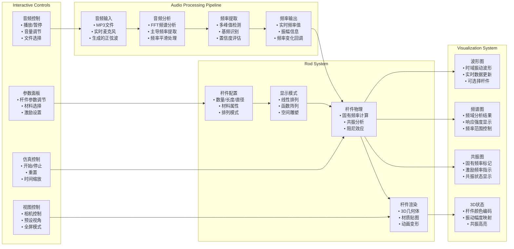
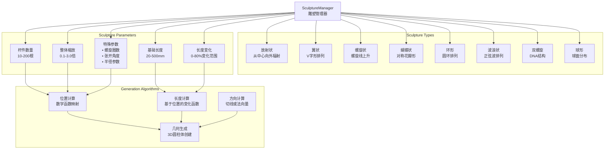
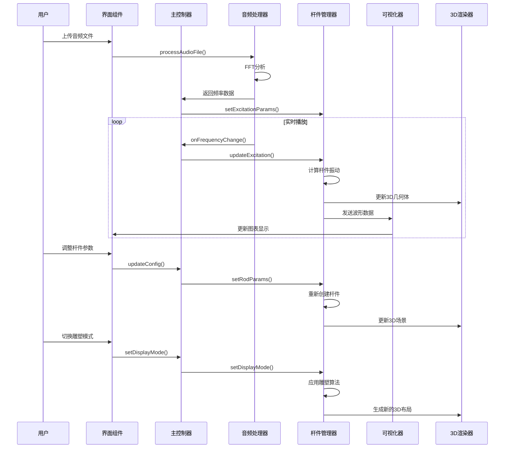

# ViewSound 声音可视化系统 - 系统架构图

## 系统架构概览

```mermaid
graph TB
    %% 外部依赖层
    subgraph "External Dependencies"
        THREE["Three.js<br/>3D渲染引擎"]
        D3["D3.js<br/>数据可视化"]
        WebAudio["Web Audio API<br/>音频处理"]
        Vue["Vue.js 3<br/>前端框架"]
        Vite["Vite<br/>构建工具"]
        Tailwind["Tailwind CSS<br/>样式框架"]
    end

    %% 前端界面层
    subgraph "Frontend UI Layer"
        App["App.vue<br/>主应用组件"]
        AudioPlayer["AudioPlayer.vue<br/>音频播放器组件"]
        VibrationControls["VibrationControls.vue<br/>振动控制面板"]
        Welcome["Welcome组件<br/>欢迎界面"]
    end

    %% 核心业务层
    subgraph "Core Business Layer"
        MainController["MainController<br/>主控制器"]
        RodManager["RodManager<br/>杆件管理器"]
        AudioGenerator["AudioGenerator<br/>音频生成器"]
        Visualization["Visualization<br/>数据可视化管理器"]
    end

    %% 工具模块层
    subgraph "Utility Modules"
        AudioProcessor["AudioProcessor<br/>音频处理器"]
        VibrationCalc["VibrationCalculator<br/>振动计算器"]
        MaterialProps["MaterialProperties<br/>材料属性管理"]
        SculptureManager["SculptureManager<br/>雕塑管理器"]
        ArrayManager["ArrayManager<br/>阵列管理器"]
        MathFunctions["MathFunctions<br/>数学函数库"]
        Config["Config<br/>配置管理"]
    end

    %% 数据处理层
    subgraph "Data Processing"
        FFT["FFT分析<br/>频率分析"]
        Resonance["共振计算<br/>固有频率计算"]
        PhysicsEngine["物理引擎<br/>杆件振动模拟"]
        RealTimeAudio["实时音频分析<br/>主导频率提取"]
    end

    %% 渲染层
    subgraph "Rendering Layer"
        Scene3D["3D场景<br/>杆件3D渲染"]
        Charts["数据图表<br/>波形/频谱/共振图"]
        Materials3D["3D材质<br/>钢材/木材/碳纤维等"]
        Lighting["光照系统<br/>环境光/平行光/点光源"]
        Controls["交互控制<br/>缩放/旋转/选择"]
    end

    %% 连接关系
    Vue --> App
    App --> AudioPlayer
    App --> VibrationControls
    App --> Welcome

    App --> MainController
    MainController --> RodManager
    MainController --> AudioGenerator
    MainController --> Visualization
    MainController --> AudioProcessor

    RodManager --> VibrationCalc
    RodManager --> MaterialProps
    RodManager --> SculptureManager
    RodManager --> ArrayManager
    RodManager --> THREE

    AudioProcessor --> WebAudio
    AudioGenerator --> WebAudio
    AudioPlayer --> WebAudio

    Visualization --> D3
    
    VibrationCalc --> MathFunctions
    VibrationCalc --> Config

    RodManager --> Scene3D
    RodManager --> Materials3D
    RodManager --> Lighting
    RodManager --> Controls

    AudioProcessor --> FFT
    AudioProcessor --> RealTimeAudio
    VibrationCalc --> Resonance
    VibrationCalc --> PhysicsEngine

    Visualization --> Charts

    %% 样式定义
    classDef externalDep fill:#e1f5fe,stroke:#01579b,stroke-width:2px
    classDef frontend fill:#f3e5f5,stroke:#4a148c,stroke-width:2px
    classDef core fill:#e8f5e8,stroke:#1b5e20,stroke-width:2px
    classDef utility fill:#fff3e0,stroke:#e65100,stroke-width:2px
    classDef data fill:#fce4ec,stroke:#880e4f,stroke-width:2px
    classDef render fill:#f1f8e9,stroke:#33691e,stroke-width:2px

    class THREE,D3,WebAudio,Vue,Vite,Tailwind externalDep
    class App,AudioPlayer,VibrationControls,Welcome frontend
    class MainController,RodManager,AudioGenerator,Visualization core
    class AudioProcessor,VibrationCalc,MaterialProps,SculptureManager,ArrayManager,MathFunctions,Config utility
    class FFT,Resonance,PhysicsEngine,RealTimeAudio data
    class Scene3D,Charts,Materials3D,Lighting,Controls render
```

## 详细功能模块架构

## 雕塑模式详细架构

## 数据流架构

## 技术栈总结

- **前端框架**: Vue.js 3 + Composition API
- **3D渲染**: Three.js (WebGL)
- **数据可视化**: D3.js
- **音频处理**: Web Audio API
- **构建工具**: Vite
- **样式框架**: Tailwind CSS
- **物理计算**: 自研振动算法
- **数学计算**: 自实现FFT + 共振分析 